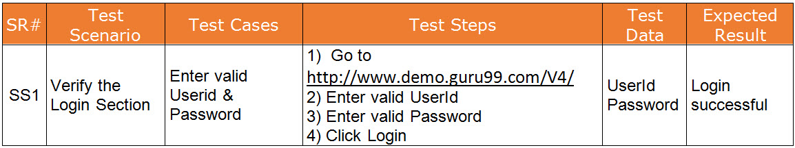
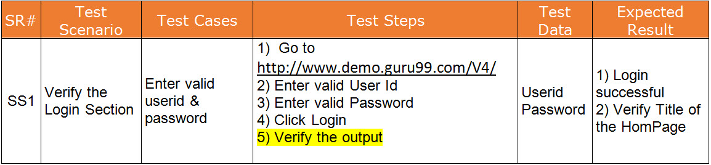

# Day 1: Project Kickoff!

The client has requested you to use WebDriver (Firefox Driver) for the project. Go ahead and record the script in Webdriver.

## Steps to get access to Test Site

1. Visit - http://demo.guru99.com/
2. Enter your email id
3. Login credentials is allocated to you and mailed at your id
4. Login credentials are only valid for 20 days! So Hurry Up and quickly create your Selenium Test Cases

# Day 2: Enhancements in Script

## But WAIT!

There is another major flaw. The script is a rookie script & in not production ready.

Here is how you can make the script production ready

1- The code to setup and launch WebDriver (Firefox) should be improved to include Location   Firefox.exe    and a Firefox Profile must be created.
2- The amount of time the driver should wait when searching for a GUI element should be specified
3- The code to setup and launch Firefox should be created as a separate method.
4- All script initialization parameters like Location of Firefox , Base URL, User Name , Password etc should be stored in separate file say Util.java.  This helps in easy maintenance of script

Go ahead and code the script.
